# 🍲 BendenMutfağınıza - Restoran Yönetim, Sipariş ve Yapay Zeka Destekli Sistem

Bu proje, bir ev yemekleri restoranında hem müşteri hem yönetici tarafının süreçlerini kolaylaştırmak amacıyla geliştirilmiş bir **sipariş ve yönetim sistemi**dir.

Klasik masa-sipariş sistemlerinin ötesine geçerek, **gerçek zamanlı bağlantı (SignalR)** ile çalışan masa yönetimi sağlar.  
Ayrıca projede entegre edilen **Yapay Zeka modülü** sayesinde:

- 👩‍⚕️ Seçilen yemeğin **kalori değerini tahmin eder**  
- 🧂 Bir yemeğin **içerisindeki malzemeleri analiz eder ve listeler**

Bu sayede kullanıcılar hem bilinçli beslenme konusunda destek alır hem de ürün içeriğini öğrenerek tercih yapabilir.

---

## 🚀 Özellikler

### 👥 Müşteri Paneli

- 🪑 Masaya oturup sipariş verme
- 🍽️ Her masa ayrı ayrı tanımlanabilir
- ⛔ Dolu masaya başka kullanıcı sipariş veremez
- ✅ Sipariş sonrası masa otomatik olarak dolu olarak işaretlenir
- 🔄 SignalR sayesinde tüm masa durumları anlık güncellenir
- 🍽️ Apiden yemek tariflerinin videolarına ulaşılır
- 🔒 Rezervasyon oluşturulabilir
- 💭 Müşteriler yorum ekleyebilir

### 🔧 Admin Paneli

- 📦 Ürün ekleme / çıkarma / güncelleme
- 👥 Kullanıcılara mail gönderme
- 🪑 Masa yönetimi (ekle, sil, durum değiştir)
- 📝 Sayfa bilgilerini (açıklama, başlık vs.) değiştirme
- 📊 Gerçek zamanlı istatistik takibi (sipariş sayısı, dolu masa oranı, aktif kullanıcılar...)
- 🔔 Anlık sipariş bildirimleri (SignalR üzerinden)
- 🧾 Günlük ve haftalık satış raporları
- 📝 Admin kullanıcı adı-şifre güncelleme
- 🧾 Ürünlere özgü QR Code oluşturabilir
- 📨 Kullanıcıyla anlık mesajları

---

## 🛠️ Kullanılan Teknolojiler

- ASP.NET Core
- SignalR (gerçek zamanlı bağlantı için)
- Entity Framework Core
- JavaScript / Razor Pages veya Blazor (arayüzüne bağlı)
- SQL Server / SQLite
- Bootstrap / Tailwind (stil sistemi kullandıysan)

---

## 🖼️ Ekran Görüntüleri

### Admin Panel
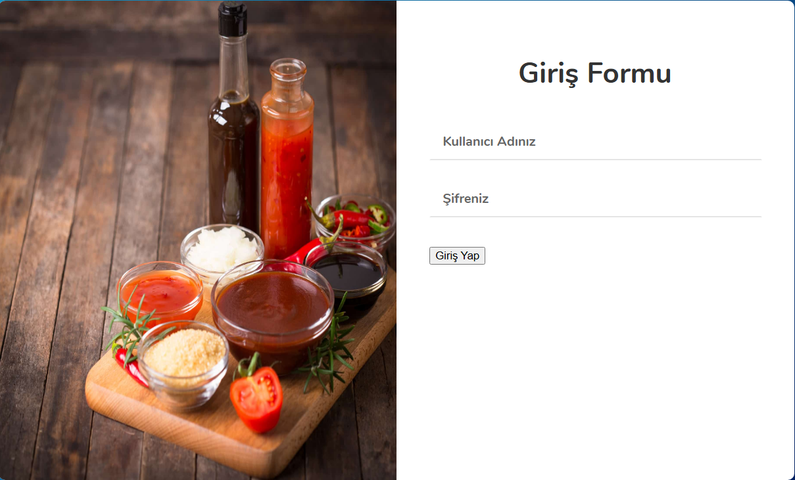
.png)
.png)
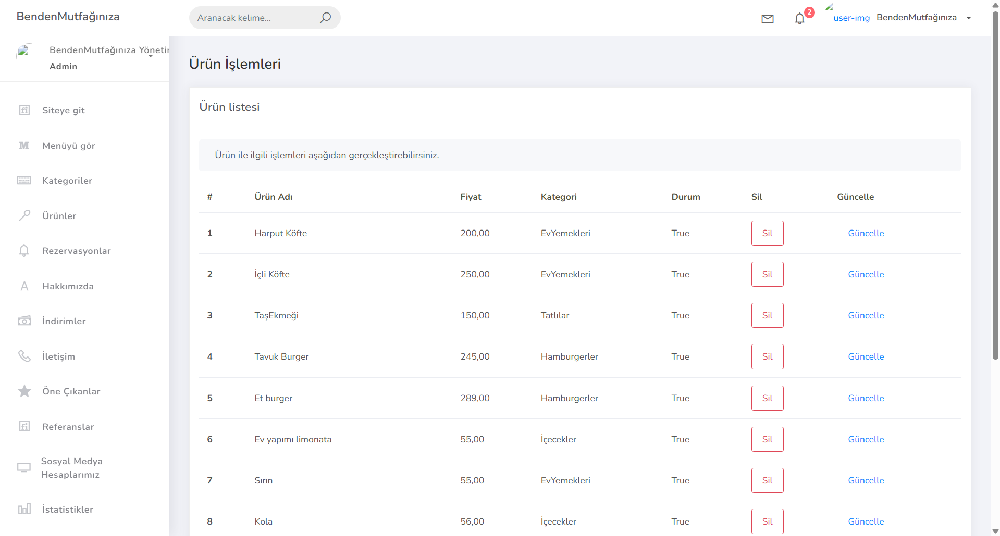
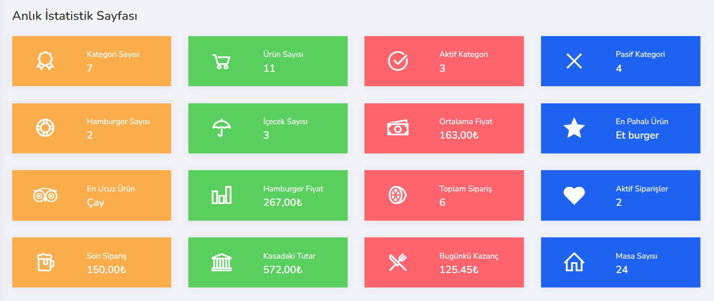

### Masa Seçim Ekranı
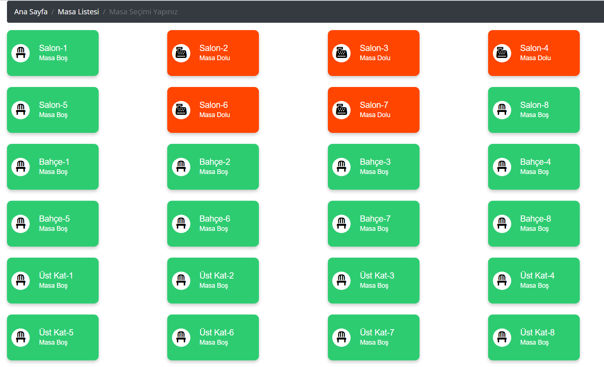

### Sipariş Verme
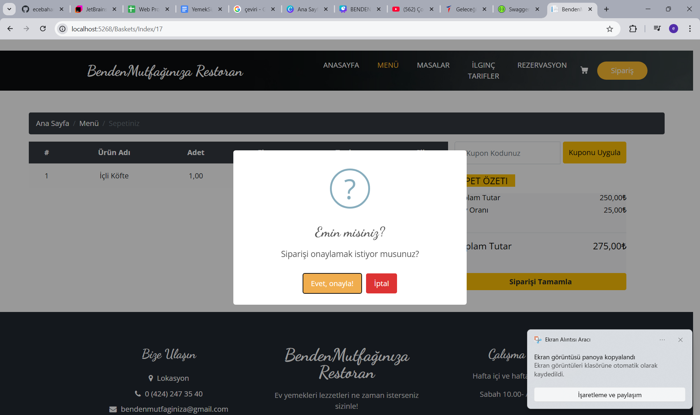

### Hakkımızda
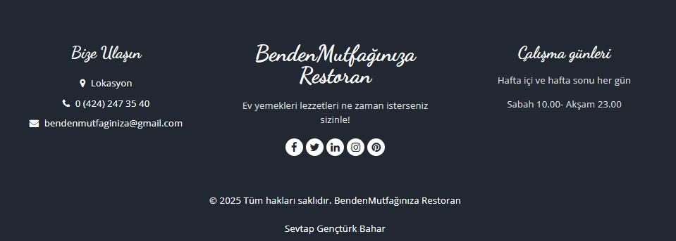

### Rezervasyon
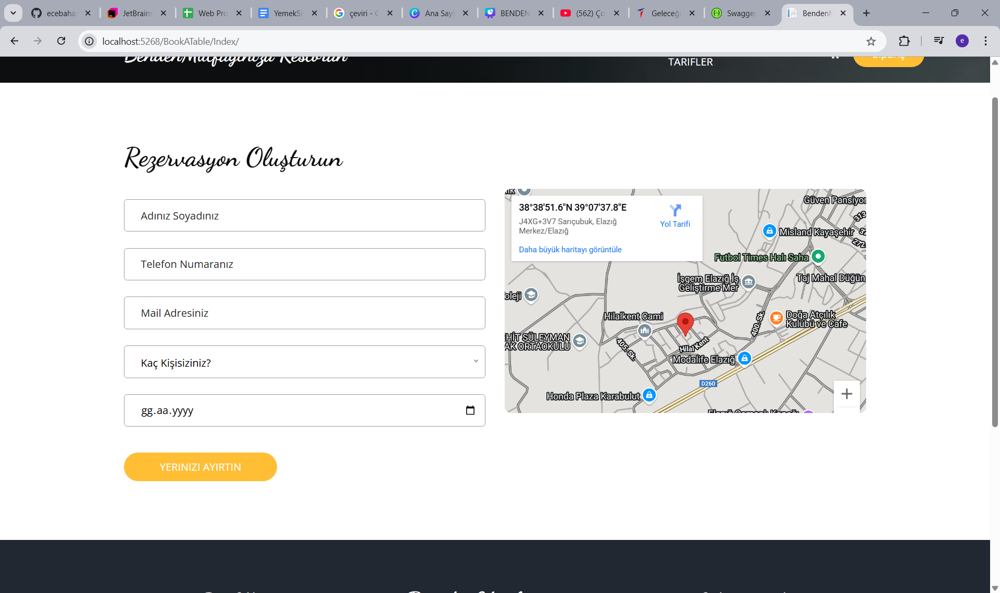

### Yapay Zeka Desteği
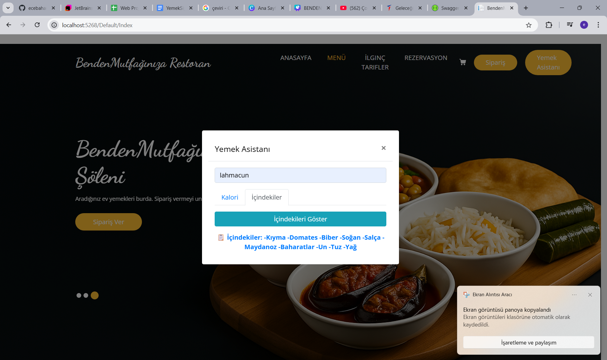
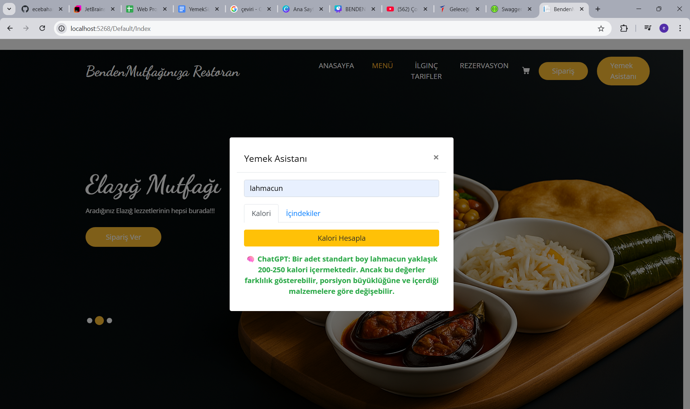

### 

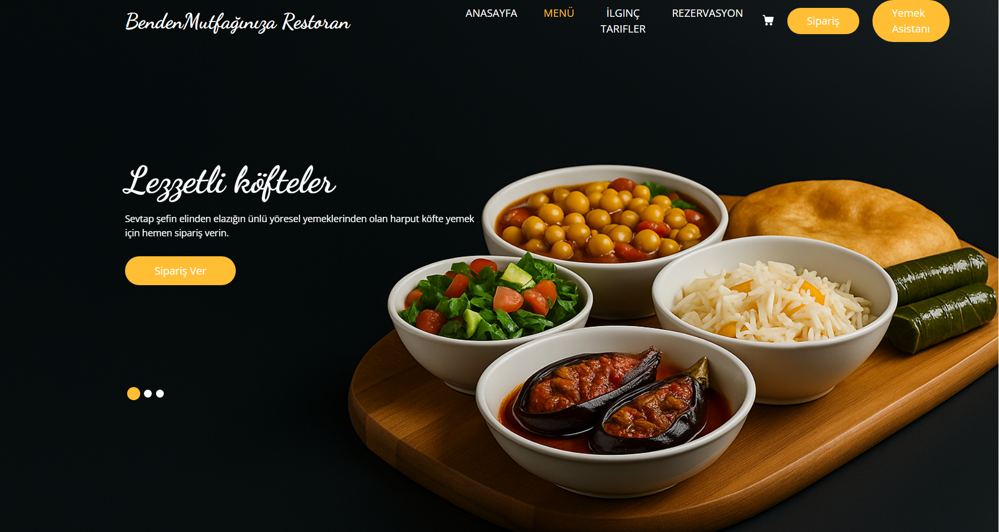

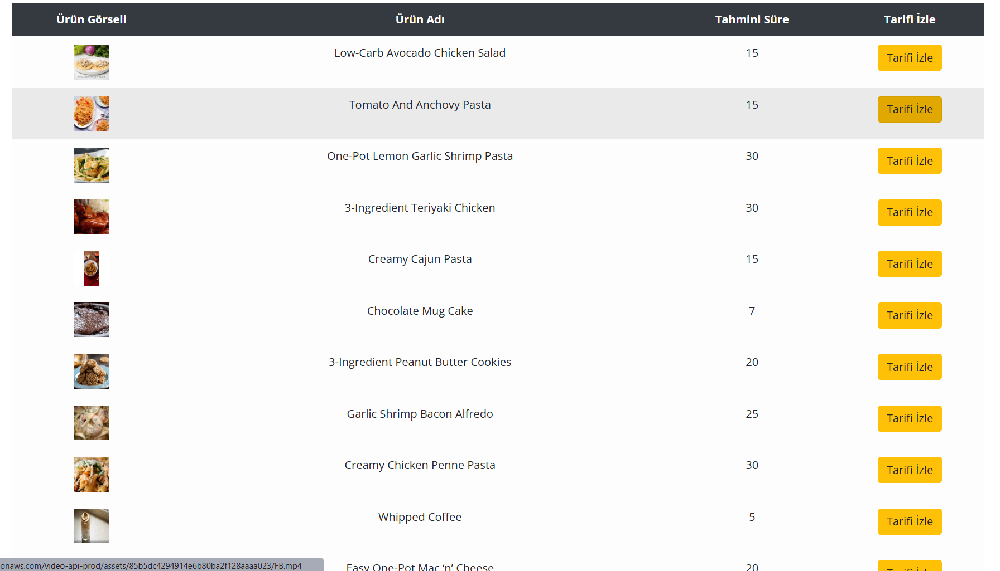

